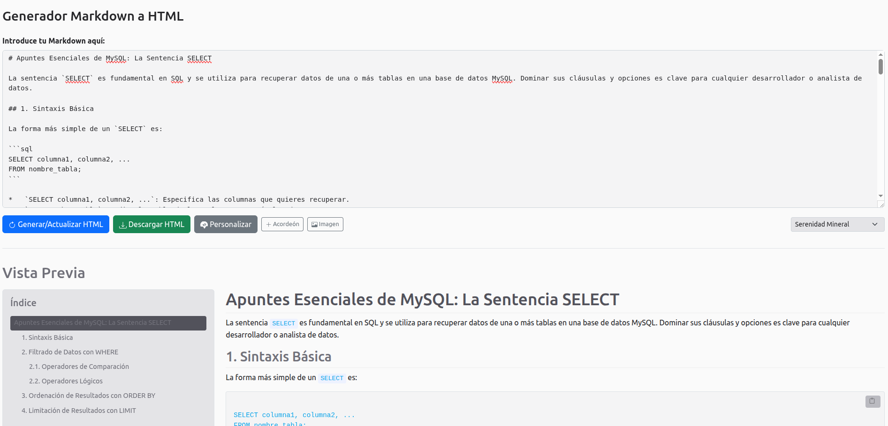
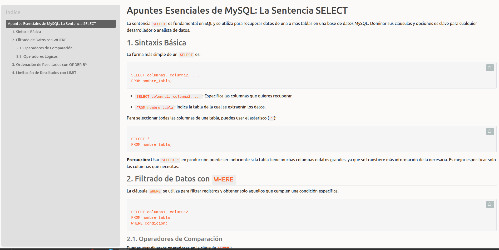

# 📝 Markdown to HTML Enhanced

[](https://developer.mozilla.org/en-US/docs/Web/Guide/HTML/HTML5)
[](https://developer.mozilla.org/en-US/docs/Web/CSS)
[](https://developer.mozilla.org/en-US/docs/Web/JavaScript)
[](https://getbootstrap.com/)
[](https://marked.js.org/)
[](https://github.com/cure53/DOMPurify)
[](https://Soyunomas.github.io/markdown-to-html-enhanced/Markdown_to_html.html)

**Convierte tu Markdown en documentos HTML autocontenidos, estilizados y perfectamente indexados, directamente en tu navegador.** Esta herramienta es ideal para organizar documentación o notas en formato HTML portable, ofreciendo una vista previa en tiempo real, una profunda personalización de estilos con temas, generación automática de índice, soporte para acordeones, embebido de imágenes locales y mucho más. El valor principal reside en la capacidad de generar un único archivo HTML que incluye todo lo necesario para su visualización y funcionamiento.

## 🚀 Probar la Herramienta

*   **Demo Online (Recomendado para una prueba rápida)**
  
    [](https://Soyunomas.github.io/markdown-to-html-enhanced/Markdown_to_html.html)


## 🖼️ Vistazo Rápido

<table>
  <tr>
    <td align="center"><strong>Interfaz de Usuario de la Herramienta</strong></td>
    <td align="center"><strong>Ejemplo de Documento HTML Resultante</strong></td>
  </tr>
  <tr>
    <td width="50%"></td>
    <td width="50%"></td>
  </tr>
</table>

✨ **[Ver un documento de ejemplo generado con esta herramienta](https://Soyunomas.github.io/markdown-to-html-enhanced/example.html)** ✨

## ✨ Características Principales

*   **Conversión Markdown a HTML:** Utiliza `marked.js` para una conversión robusta y compatible con GFM.
*   **Soporte para HTML Directo:** Inserta código HTML directamente dentro de tu Markdown para estructuras o elementos personalizados que van más allá de la sintaxis Markdown estándar.
*   **Documentos HTML Autocontenidos:**
    *   Genera un único archivo `.html` que incluye todo:
        *   Contenido HTML convertido (desde Markdown y HTML directo) y sanitizado.
        *   Índice interactivo y funcional.
        *   Todos los estilos CSS (variables personalizadas + estilos base) embebidos.
        *   Imágenes locales seleccionadas, embebidas como Base64.
        *   El JavaScript necesario para la interactividad (ScrollSpy, botones de copiar).
    *   Ideal para portabilidad, compartir y archivar sin dependencias externas.
*   **Vista Previa Dinámica:** Observa tus cambios al instante mientras editas el Markdown o ajustas los estilos.
*   **Generación Automática de Índice (TOC):**
    *   Crea un índice lateral navegable a partir de los encabezados `<h1>` a `<h6>` del contenido.
    *   Integrado con ScrollSpy de Bootstrap para resaltar la sección activa.
*   **Personalización Avanzada de Estilos:**
    *   **Editor de Colores en Tiempo Real:** Ajusta los colores de encabezados, texto, enlaces, código, fondos, índice y más, con vista previa inmediata.
    *   **Extensa Biblioteca de Temas:** Elige entre más de 50 temas predefinidos (claros y oscuros) para transformar la apariencia de tu documento con un solo clic.
    *   **Adaptación a Tema Oscuro/Claro:** Detecta y aplica automáticamente `data-bs-theme="dark"` (Bootstrap) según el tema seleccionado.
*   **Funcionalidades Extendidas:**
    *   **Acordeones Bootstrap:** Inserta fácilmente acordeones colapsables usando la sintaxis especial en Markdown `++S Título del Acordeón ... ++E`. El contenido del acordeón también soporta Markdown.
    *   **Embebido de Imágenes Locales:** Selecciona imágenes desde tu dispositivo; se insertará un marcador en el Markdown y la imagen se convertirá a Base64, integrándose directamente en el HTML.
*   **Botones "Copiar Código":** Se añaden automáticamente a todos los bloques de código (`<pre>`) generados desde Markdown.
*   **Seguridad:** Utiliza `DOMPurify` para sanitizar el HTML (tanto el generado por Markdown como el insertado directamente), protegiendo contra ataques XSS.
*   **Interfaz Intuitiva y Responsiva:** Construida con Bootstrap 5, la herramienta es fácil de usar en cualquier dispositivo. El índice se oculta en pantallas pequeñas para una mejor experiencia.
*   **Utilidades de Edición:** Botones para insertar rápidamente plantillas de sintaxis de acordeón y marcadores de imagen en el editor Markdown.

## 🛠️ Tecnologías Utilizadas

*   HTML5 (Semántico)
*   CSS3 (con un uso intensivo de Variables CSS para tematización)
*   JavaScript (ES6+, Vanilla JS puro, sin frameworks JS)
*   Bootstrap 5.3.3 (Framework CSS y Componentes JS)
*   Bootstrap Icons 1.11.3
*   [Marked.js](https://marked.js.org/): Potente librería para parsear Markdown a HTML.
*   [DOMPurify](https://github.com/cure53/DOMPurify): Sanitizador de HTML robusto y rápido.

## 🚀 Cómo Empezar

1.  **Clona este repositorio (opcional, para desarrollo o uso offline):**
    ```bash
    git clone https://github.com/Soyunomas/markdown-to-html-enhanced.git # Reemplaza con el nombre final del repo si es diferente
    cd markdown-to-html-enhanced # Reemplaza con el nombre final del repo si es diferente
    ```
2.  **Abre el archivo `Markdown_to_html.html` en tu navegador web preferido.**
    *   ¡No se requiere servidor ni pasos de compilación!

## 📖 Uso de la Herramienta

1.  **Introduce tu Markdown:** Escribe o pega tu contenido en el área de texto de la izquierda.
2.  **Genera/Actualiza:** Haz clic en el botón "Generar/Actualizar HTML". La vista previa aparecerá a la derecha, junto con el índice.
3.  **Personaliza (Opcional):**
    *   Haz clic en el botón "Personalizar" (icono de paleta) para abrir el panel de estilos. Modifica los colores usando los selectores. Los cambios se aplican en tiempo real.
    *   Elige un tema del desplegable "Seleccionar Tema" para aplicar rápidamente un conjunto de estilos.
4.  **Inserta Elementos (Opcional):**
    *   Utiliza el botón **"+ Acordeón"** para añadir una plantilla de acordeón a tu Markdown.
    *   Usa el botón **"+ Imagen"** para seleccionar una imagen de tu ordenador. Se insertará un placeholder en el Markdown y la imagen se embeberá en la vista previa y en la descarga.
5.  **Descarga tu HTML:** Cuando el documento esté listo, haz clic en "Descargar HTML". Se generará un archivo `.html` completo y auto-contenido en tu carpeta de descargas.

## 💡 Posibles Mejoras y Futuras Características

*   **Persistencia Local:** Guardar el contenido Markdown y las personalizaciones de estilo en `localStorage` para que no se pierdan al cerrar/recargar la pestaña.
*   **Gestión de Temas:** Permitir guardar/cargar temas personalizados.
*   **Más Opciones de `marked.js`:** Exponer configuraciones avanzadas de `marked.js` en la interfaz.
*   **Soporte para Diagramas:** Integración con librerías como Mermaid.js para renderizar diagramas desde Markdown.
*   **Arrastrar y Soltar Imágenes:** Permitir añadir imágenes arrastrándolas al área de texto.
*   **Exportar Configuración de Estilos:** Poder descargar solo las variables CSS del tema actual.
*   **Número de Línea en Textarea:** Opcional.

---

## 📜 Licencia

Este proyecto está bajo la Licencia MIT. Consulta el archivo `LICENSE` para más detalles.

Copyright (c) 2025 Soyunomas.

---
